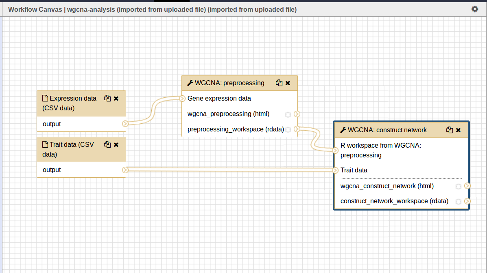
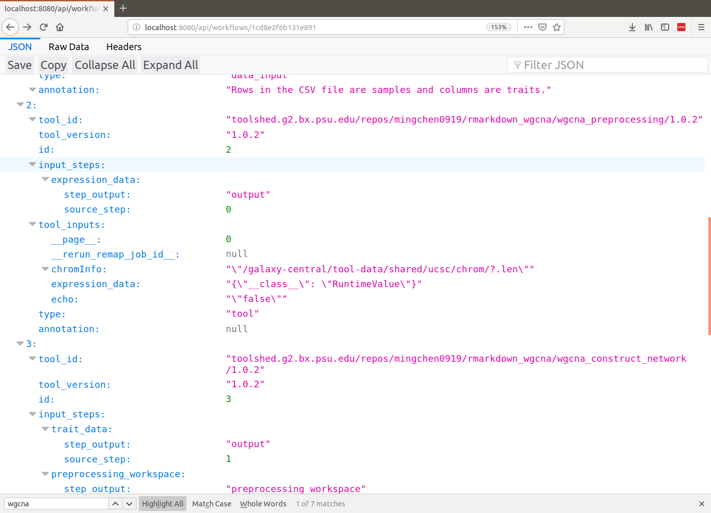
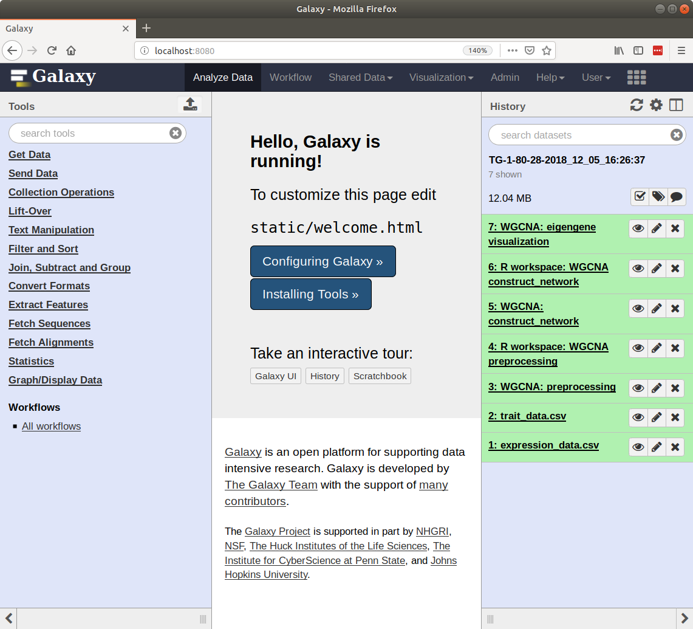

Tripal Galaxy API Overview
==========================
Here code examples and brief descriptions are provided for common applications of the Tripal Galaxy API.  Not all arguments for all API functions are thoroughly described. Please see the :doc:`./api_funcs` page for specific details.

.. _blend4php: https://github.com/galaxyproject/blend4php
.. _blend4php_docs: http://galaxyproject.github.io/blend4php/docs-v0.1a/html/annotated.html

Adding a Galaxy Server
----------------------
The Tripal Galaxy module allows a site administrator to add a new Galaxy Server to Tripal using an online web interface. However, you can programmatically add a new Galaxy server using the ``tripal_galaxy_add_galaxy`` function.  For example:

.. code-block:: php

  // Get the current user.
  global $user;

  // Prepare the information needed for the server.
  $data = array(
    'servername' => 'Use Galaxy Public',
    'description' => 'The public server provided by the Galaxy Project,
    'url' => 'https://usegalaxy.org/',
    'username' => 'fakeuser',
    'api_key' => '48eead1213e5dd6d1876811b38b66e51',
    'uid' => $user->uid,
  );
  
  // Add the Galaxy server.
  $galaxy = tripal_galaxy_add_galaxy($data);
  
A use case when you may want to programmatically add a new Galaxy server is if you want to provide your own interface for allowing others to add new servers besides the site admin.  

Get a List of Galaxies
----------------------
You can retrieve a list of all Galaxy servers known to Tripal by calling the ``tripal_galaxy_get_galaxies`` function. 

.. code-block:: php

  // Get the list of galaxies.
  $galaxies = tripal_galaxy_get_galaxies();
  
  // Iterate through that list to perform actions on each, or retrieve 
  // information.
  foreach ($galaxies as $galaxy) {
  
    // Get the galaxy ID
    $galaxy_id = $galaxy->galaxy_id;
    
    // Do stuff here.
  }
   

Connect to Galaxy
-----------------
Before any communication between Tripal and Galaxy can happen a connection between the two must be made.  Blend4php will allow you to connect directly to a Galaxy instance if you know the URL. However, it is recommended to use the Tripal API to make the connection.

If the site admin has already added a Galaxy server using the web interface then you can connect to the Galaxy server using its internal ID.  The ``tripal_galaxy_get_connection`` function can be used. It returns an instance of a  ``GalaxyInstance``. 

For example:

.. code-block:: php

  // Connect to the Galaxy instance using a galaxy ID we retrieved in an
  // earlier step.
  $galaxy = tripal_galaxy_get_connection($galaxy_id);
  
  // It is always good to make sure we got a valid connection. If we didn't
  // then we can retreive any connection errors using the getError() member
  // function.
  if (!$galaxy) {
    $error = $galaxy->getError();
    drupal_set_message('Could not connect to Galaxy server. ' . $error['message'], 'error');
  }

In the example code above above, the ``tripal_galaxy_get_connection`` function returns an instance of the blend4php_ ``GalaxyInstance`` class that we named ``$galaxy``. This instance is used by all other functions used by blend4php to interact with Galaxy.  To learn more about this object and the functionality it provides please see the blend4php_docs_.

Test if a Galaxy server is accessible.
--------------------------------------
If a Galaxy server is not accessible no actions can be performed including workflow submissions, status updates, or results display. A server may not be accessible if it it is offline.  You can check the status of a galaxy workflow with the ``tripal_galaxy_test_connection`` function. 

.. code-block:: php

  $is_connected = tripal_galaxy_test_connection(['galaxy_id' => $galaxy_id]);
  if (!$is_connected) {
    // Do something here.
  }

Add a Workflow to Tripal
------------------------
The Tripal GAlaxy module does not allow a user to create Galaxy workflows.  Workflows should always be created on the Galaxy interface.  Once a workflow is created it can be added to Tripal. A site administrator can add new workflows to Tripal using the web interface.  However, you can programmatically add a new workflow using the ``tripal_galaxy_add_workflow`` function.  To do this you must know have the ID of the galaxy server and the name or workflow_id of the workflow on the Galaxy server.  You can obtain the name or workflow_id from the Galaxy server by:

1. Using the blend4php `GalaxyWorkflows::index() <http://galaxyproject.github.io/blend4php/docs-v0.1a/html/classGalaxyWorkflows.html>`_ function and examining the resulting array.
2. Directly retrieving a JSON array of results from the Galaxy server's RESTful API services available at the URL `api/workflows` (e.g. https://usegalaxy.org/api/workflows).  You can view results in a web browser if you have a plugin for viewing JSON arrays.  You must first login to Galaxy before using the RESTful web services.

.. code-block:: php

  $values = [
     'workflow_id' => 'ebfb8f50c6abde6d',
  ];
  $workflow = tripal_galaxy_add_workflow($galaxy_id, $values, TRUE);

The ``tripal_galaxy_add_workflow`` will connect to the remote Galaxy server, retrieve the workflow infomation and add it to Tripal.  If you want your site visitors to be able to submit the workflow for execution set the last argument to TRUE to create the web form for the workflow.

Prepare a Workflow for Execution
--------------------------------
If a web form was created for a workflow then your site visitors can submit the workflow for execution using the web interface to provide input data and settings.  However, you can submit a workflow programmatically.  To do this, use the ``tripal_galaxy_init_submission`` function to first prepare the submission.  For this function you must specify the workflow object and the user that is submitting it.  The workflow object can be retrieved using the ``tripal_galaxy_get_workflows`` by providing values to uniquely select it.

.. code-block:: php

  // Get the current user.
  global $user;

  // Provide the values to uniquely find the workflow.
  $values = [
    'workflow_id' => 'ebfb8f50c6abde6d',
    'galaxy_id' => $galaxy_id,
  ]
  
  // Find the workflow using the values. This function always returns an
  // array of workflows that match the criteria.  By providing the workflow_id
  // and the galaxy_id it should only ever match one workflow.
  $workflows = tripal_galaxy_get_workflows($values);
  $workflow = $workflows[0];
  
  // We can now initialize the workflow submission.
  $sid = tripal_galaxy_init_submission($workflow, $user);
  
  // The submission ID will uniquely identify this submission.  Next get the
  // submission object.
  $submission = tripal_galaxy_get_submission($sid);
  
The workflow is now ready to be invoked.
 
Get a History Name
------------------
Before we can invoke a workflow we need to understand Galaxy histories. All data in Galaxy is housed in a data collection referred to as a "history". Before workflows can be executed, input data must be placed in a history, and after workflow execution, resulting data is found in the history.  For more information about histories in Galaxy you can view the `histories tutorial page <https://galaxyproject.org/tutorials/histories/>`_.

When Tripal Galaxy invokes a workflow within Galaxy it will ensure that each invocation uses a unique history with a unique name.  By default Tripal Galaxy module uses a naming schema for histories: `TG-[UID]-[WID]-[SID]-[Date]`. 

Where 

- ``[UID]`` is the user ID of the Drupal user who is submitting/submitted the workflow 
- ``[WID]`` is the Tripal Galaxy module's ID for the workflow 
- ``[SID]`` is the Tripal Galaxy submission ID for the workflow submisiion and
- ``[Date]`` is the date that the submission was made.  

For example the following is history name that follows this scheme:  ``TG-1-53-19-2018_10_03_09:31:02``

Before invoking a workflow you will need to create the history and you should follow the Tripal naming scheme to name that history.  To retrieve the name for any history use the ``tripal_galaxy_get_history_name`` function.

.. code-block:: php

  // Retrieve the $submission object using a known submission ID.
  $submission = tripal_galaxy_get_submission($sid);
  
  // Get the history name.
  $history_name = tripal_galaxy_get_history_name($submission);

Create a History and Upload Files
---------------------------------
Before we invoke a workflow we must ensure that the requried input data files are in a history on the remote Galxy server. For loading files from your local Tripal site into Galaxy use the ``tripal_galaxy_upload_file`` function.  This function expects that any files you upload to Galaxy are also know by Drupal, therefore you must use the `Drupal 7 File API <https://www.drupal.org/docs/7/api/file-api>`_.  The following shows an example for how to do this:

.. code-block:: php

  // The current user owns the file.
  global $user;

  // The Drupal File API uses Streams (i.e public://, private://, etc) which
  // point to files within the Drupal directory heirarchy.
  $uri = 'public://reads_1.fastq';
    
  // Create a new file object.
  $file = new stdClass();
  $file->uri = $uri;
  $file->filename = 'reads_1.fastq';
  $file->filemime = file_get_mimetype($uri);
  $file->uid = $user->uid;
  $file->status = FILE_STATUS_PERMANENT;
  $file = file_save($file);
  $fid = $file->fid;
  
  // We don't want the file to disappear when Drupal performs it's cleaning so
  // we have to tell Drupal that the file is being used.  See the Drupal
  // documentation for the meaning of the input arguments.
  file_usage_add($file, 'my_module', 'workflow1_reads', $sid);

Now that Drupal is aware of the file there are a few additional steps before we can upload it to Galaxy. First, we must ensure that a history exists on the remote Galaxy server. Remember, that all workflow submissions use a unique history name. We should use that history name to create the history. The history is created using the ``tripal_galaxy_create_history`` function.

.. code-block:: php

  // Retrieve the $submission object using a known submission ID.
  $submission = tripal_galaxy_get_submission($sid);
  
  // Get the history name.
  $history_name = tripal_galaxy_get_history_name($submission);
  $history = tripal_galaxy_create_history($galaxy, $history_name);
  if ($history === FALSE) {
    $error = $galaxy->getError();
    throw new Exception($error['message']);
  }
  

Next, we need the current contents of the history.  If the history did not exist then the history should be empty.  However, the same workflow submission can be invoked multiple times so we need to get the contents of the history to pass into the `tripal_galaxy_upload_file` function. 

.. code-block:: php

  // Get the history contents so we don't upload the same file more than once
  // in the event that this invocation occurs more than once.
  $ghistory_contents = new GalaxyHistoryContents($galaxy);
  $history_contents = $ghistory_contents->index(['history_id' => $history['id']]);
  if ($history_contents === FALSE) {
    $error = $galaxy->getError();
    throw new Exception($error['message']);
  } 

Now we have sufficient information to upload our file to Galaxy. Our file is known to Drupal, we have a history, and we have the history contents. 

.. code-block:: php

  // Upload the file to Galaxy.
  $galaxy_file = tripal_galaxy_upload_file($galaxy, $fid, $history['id'], $history_contents);
        
The returned ``$galaxy_file`` variable contains information about the file on the galaxy server.  We will need this later when invoking the workflow. 

Invoke a Workflow
-----------------
Workflows are the multistep process through which data is submitted, analysed, processed, and then results provided. Workflows are created in Galaxy, they cannot be created in Tripal Galaxy. 

For more information on creating and editing workflows please see the `online turorial <https://galaxyproject.org/tutorials/g101/#creating-and-editing-a-workflow>`_.

Before invoking the workflow all data files need to be uploaded to a Galaxy history. Examples for how to do this were shown in the previous section. To invoking a workflow use the ``tripal_galaxy_invoke_workflow`` function.  It requires two complex arrays: ``$parameters`` and ``$inputs``. These provide the tool settings for the workflow and the input files needed to start the workflow. Construction of these arrays will require a good understanding of each workflow's needs. 

For example, consider the following worklow.  It has four steps, with two initial steps providing only input data and the other two using actual analytical tools.

The first two steps require input files. Therefore, we will indicate where these are using the ``$inputs`` array.  This is an associative array containing the files used by the workflow and their location in the Galaxy server. An input array may look like the following:

.. code-block:: php

  $inputs = [
    [0] => [
      [id] => 70eec96181a992f8,
      [src] => hda,
    ],
    [1] => [
      [id] => 8317ee2b0d0f62d9,
      [src] => hda,
    ],
  ];

The first-level keys are numeric (e.g. 0 and 1).  These indicate the steps in the workflow that require input.  For each there is an ``id`` and ``src`` key.  The id is the Galaxy ID for the file. We can retrieve this id from the ``$galaxy_file`` array we retrieved above when we called the ``tripal_galaxy_upload_file`` function.

The src indicates where the file can be found. The value ``hda`` indicates the file is in the History Dataset Assocation (HDA) which is the default history storage location. See the ``tripal_galaxy_invoke_workflow`` function definition on the :doc:`./api_funcs` page for a more in-depth meaning of the ``$inputs`` array structure.

Similarly, the ``$parameters`` argument is an associative array whose first-level keys are the numeric index for the steps in the workflow and the settings for the tool at each step are provided. 

.. code-block:: php

  $parameters = [
    [0] => [
      [Data File] => 70eec96181a992f8,
    ],
    [1] => [
      [Data File] => 8317ee2b0d0f62d9,
    ],
    [2] => [
      [expression_data] => [
          [step_output] => output,
          [source_step] => 0,
      ],
      [echo] => no,
    ],
    [3] => [
      [preprocessing_workspace] => [
          [step_output] => preprocessing_workspace,
          [source_step] => 2,
      ],
      [height_cut] => 15,
      [trait_data] => [
          [step_output] => output,
          [source_step] => 1,
      ],
      [echo] => no,
    ],
  ];
  
Note that for steps 0 and 1 the setting name is ``Data File`` and the value is the file ID used in the ``$inputs`` array.  For all other steps, the settings are specified.  

.. note:: 

  Every workflow is different and as such the ``$input`` and ``$parameters`` arrays will be different from those shown in the examples above.
  
It can be very challenging to determine the proper elements and structure of the ``$parameters`` array.  For example, the following view of the JSON for a workflow shows how a workflow is structured in Galaxy.  To build the ``$parmaters`` array one would need to find them in the ``tool_inputs`` for each step and be sure to use the ``input_steps`` info for inputs that use values from previous steps.  It can be quite complicated.

To simplify this process, you can retrieve a pre-populated ``$parameters`` array and change the values as needed.  You can do so by calling the ``tripal_galaxy_get_workflow_defaults`` function:

.. code-block:: php

  $parameters = tripal_galaxy_get_workflow_defaults($galaxy, $workflow_id)

Now we have everything we need to invoke a workflow:

1.  A submission record
2.  A history on the remote Galaxy ID
3.  Uploaded files into the history
4.  An ``$inputs`` array indicating where input files are found in the galaxy
    server.
5.  A ``$parameters`` array containing all of the tool settings.

.. code-block:: php

  // Call the Tripal Galaxy API function to invoke this workflow.
    tripal_galaxy_invoke_workflow($galaxy, $submission, $parameters, 
      $input_datasets, $history);

An email will be sent to the user indicating that the workflow has been submitted for execution.

.. note:: 

  It can take quite a while to upload files and invoke workflows because of the time needed to upload large files.  Consider uploading files and invoking workflows using the Tripal Job system. This way you can submit a job to invoke the workflow, your script will return immediatly rather than wait, and the next time the Tripal Job queue is launched your workflow will be invoked.

Check the status of a workflow submission
-----------------------------------------
By invoking a workflow you indicate to the Galaxy server that the workflow should be executed.  You must then wait for Galaxy to execute your workflow submission once resources become available.  Additionally, depending on the amount of data and the tools used the workflow can take a long time to complete.  You therefore should periodically check the status of your workflow.  You can do so by calling the ``tripal_galaxy_check_submission_status`` function to update the status of the submitted workflow. A workflow submission on Tripal Galaxy  will have one of 4 statuses: Waiting, Submitted, Completed or Error. 

.. code-block:: php

  // First ask Tripal to update the status of the submission.
  tripal_galaxy_check_submission_status($submission->sid);
  
  // Next retrieve the submission again to check the new status.
  $submission = tripal_galaxy_get_submission($submission->sid);
  $status = $submission->status;

  
Retrieving Results from Galaxy
------------------------------
There are two primary cases in which result files from an executed workflow can be made available to end-users.  First, you may wish to retrieve the files so that they can be analyzed for visualization or for use in other workflows. This results in the files being stored locally to the Drupal server, and retrieved files will count towards Tripal's user file quota.  Second, you may simply wish to provide a download link to these files but not download them to the server.  This way, the files can remain on the Galaxy server, the files don't count towards the Tripal user quota, yet users can still retrieve them from within your application.  

Retrieving a Dataset
~~~~~~~~~~~~~~~~~~~~ 

For either option, you must first know the dataset ID. Result files are stored within the history on the remote Galaxy server. The quickest way to find the dataset ID is to retrieve a list of datasets using the ``tripal_galaxy_get_datasets`` function.

.. code-block:: php

    $datasets = tripal_galaxy_get_datasets($submission);

The ``$datasets`` variable now contains a list of datasets for the workflow invocation. 

.. note::

  You must be sure that the workflow has completed before calling the ``tripal_galaxy_get_datasets()`` function.

Suppose we have a history that appears as follows on the Galaxy server.

Note in the image above the right sidebar with the 7 datasets. When the history contents are retrieved for such a history it will be an array describing each dataset. Below is an example element in the ``$datasets`` array for the 'WGCNA: eigengene visualization' item. 

.. code-block:: php

  [
    [accessible] => 1
    [type_id] => dataset-40876639881ca029
    [file_name] => /galaxy/database/files/000/dataset_58.dat
    [resubmitted] => 
    [create_time] => 2018-12-06T00:35:05.157630
    [creating_job] => 52e496b945151ee8
    [dataset_id] => 40876639881ca029
    [file_size] => 1427219
    [file_ext] => html
    [id] => 40876639881ca029
    [misc_info] => ''
    [hda_ldda] => hda
    [download_url] => /api/histories/0c5ffef6d88a1e97/contents/40876639881ca029/display
    [state] => ok
    [display_types] => []
    [display_apps] => []
    [metadata_dbkey] => ?
    [type] => file
    [misc_blurb] => 1.4 MB
    [peek] => <table cellspacing="0" cellpadding="3"><tr><td>HTML file</td></tr></table>
    [update_time] => 2018-12-06T00:43:13.749954
    [data_type] => galaxy.datatypes.text.Html
    [tags] => []
    [deleted] => 
    [history_id] => 0c5ffef6d88a1e97
    [meta_files] => []
    [genome_build] => ?
    [hid] => 7
    [model_class] => HistoryDatasetAssociation
    [metadata_data_lines] => 150
    [annotation] => 
    [permissions] => [
      [access] => []
      [manage] => []
    ]
    [history_content_type] => dataset
    [name] => WGCNA: eigengene visualization
    [extension] => html
    [visible] => 1
    [url] => /api/histories/0c5ffef6d88a1e97/contents/40876639881ca029
    [uuid] => c5178a2d-eef5-4218-bb09-6984e56a49e3
    [visualizations] => [
      [0] => [
        [embeddable] => 
        [href] => /plugins/visualizations/charts/show?dataset_id=40876639881ca029
        [html] => Charts
        [target] => galaxy_main
      ]
    ]
    [rerunnable] => 1
    [purged] => 
    [api_type] => file
  ]

By iterating over all of the datasets we can find the dataset id of the file
we are interested in. 

.. code-block:: php

  $dataset_id = NULL;
  $datasets = tripal_galaxy_get_datasets($submission);
  foreach ($datasets as $dataset) {
    if ($dataset['name'] == 'WGCNA: eigengene visualization') {
      $dataset_id = $dataset['id'];
    }
  }

.. note::

  The Tripal Galaxy module does have a setting for how long files can stay on a remote Galaxy server before they are automatically removed.  See the :doc:`../settings` document for more details.  

Option 1: Download Files to the Server
~~~~~~~~~~~~~~~~~~~~~~~~~~~~~~~~~~~~~~ 
Once the workflow has completed you can retrieve any resulting files onto the Drupal server.  This is useful if you need to re-use the results in other workflows or if you want to make those results available to users on their Profile pages (i.e. via the ``Files`` link).  

To retrieve the file simply call the ``tripal_galaxy_download_file`` function.

.. code-block:: php

  $file = tripal_galaxy_download_file($submission, $dataset_id, $uid);
  
This function downloads the file to the Drupal server and registers it with Drupal as a file managed by Tripal.  This ensures that the file will be associated with the user ID specified by the ``$uid`` argument. Therefore, the ``$file`` variable returned will be a Drupal File object, and the file will count against the user's quota and show up on their profile page. 

.. warning::

  Be sure that you have sufficient storage space when downloading files. To help with this, Tripal provides a user quota system to which downloaded are applied.  However, be cautious of how much space is being utilized.  You can check how much space a user is currently consuming using the ``tripal_get_user_usage()`` function. If space is a concern you probably want to check the user's usage before invoking the workflow.

Option 2: Providing Download Links for Users
~~~~~~~~~~~~~~~~~~~~~~~~~~~~~~~~~~~~~~~~~~~~
Once the workflow has completed you may want to provide links for the end-user to view or download results from the workflow.  As opposed to option #1, this does not result in files being downloaded to the Drupal server and will not affect the user's file quota. To create a link for either viewing or downloading you should use the ``tripal_galaxy_get_proxy_url``.  This function returns a URL you can use in your application for viewing or downloading.  For example, the following retrieves a URL for downloading a dataset:

.. code-block:: php

    global $user;
    
    // Get the dataset.
    $dataset = tripal_galaxy_get_dataset($submission, $dataset_id);
    
    // Now get the Proxy URL and create the link.
    $proxy_url = tripal_galaxy_get_proxy_url($submission, $dataset, $uid, 'download');
    $link = l($dataset['name'], $proxy_url) . ' (' . $dataset['file_size'] . ')';

The ``$link`` variable now contains an HTML formatted link for downloading the file. It also lists the file size next to the link.  You can use this variable anywhere that you create content for a page in your application. Notice that the last argument to the ``tripal_galaxy_get_proxy_url()`` function is the string ``download``.  This is the action that the proxy URL should perform.
 
Similarly to retrieve a URL for viewing the dataset:

.. code-block:: php

  global $user;

  // Get the dataset.
  $dataset = tripal_galaxy_get_dataset($submission, $dataset_id);
  
  // Any files that are smaller than 1MB can be shown in a browser.
  if ($dataset['file_size'] < pow(10, 6)) {
    $proxy_url = tripal_galaxy_get_proxy_url($submission, $dataset, $uid, 'viewer');
    $link =  l($dataset['name'], $proxy_url);
  }
  else {
    $link =  'Result file is too large to view. Please download.';
  }
  
Note in the call to ``tripal_galaxy_get_proxy_url`` the last argument is ``viewer``. With this action, when the link is clicked the file will be shown on a results page provided by the Tripal Galaxy module.  The page displays results in an HTML IFrame.  If you prefer to show results in a stand-alone page use ``viewer-full`` as the last argument. 
