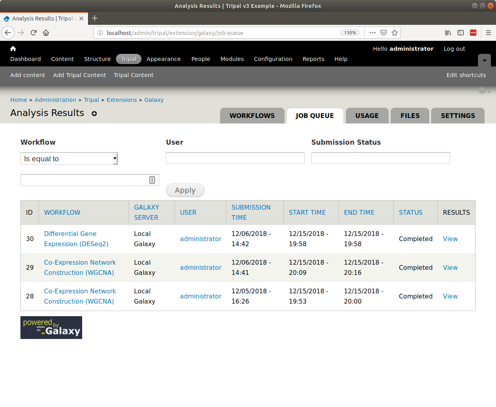

Executing Jobs and Tasks
========================

Automatic Job Execution
-----------------------
In a production setting, jobs submitted by end-users should be executed automatically.  There are two ways to automate job subimssion.  First, if you are writing your own application using :doc:`option2`, then you will most likely invoke your workflow using the Tripal Galaxy API.  In this case you are invoking the workflow instantly and nothing further is needed.  If you are using :doc:`option1`, then user submitted workflows are added to the Tripal job managment system.  You can therefore automate job execution by following the directions in the `Tripal User's Guide <https://tripal.readthedocs.io/en/latest/user_guide/install_tripal/automating_job_execution.html>`_ for job automation.  

.. note::

  For near instantaneous invocation of workflows consider using the `Tripal Daemon Module <https://tripal.readthedocs.io/en/latest/user_guide/job_management.html>`_. The Tripal Daemon runs as a background service that constantly checks for new jobs and then executes them.

Automatic Job Status Checking
-----------------------------
When submitted workflows are added to the Tripal Jobs queue or invoked via the API you will want to check the status of those jobs.  For this we need automation to ensure that jobs are checked on a regular bases.  The best way to do this is to setup an independent `Cron entry <https://en.wikipedia.org/wiki/Cron>`_  for the site.  You can also learn about Cron integration with Drupal at the `Tripal User's Guide <https://tripal.readthedocs.io/en/latest/user_guide/install_tripal/automating_job_execution.html>`_.  To automate job status checks, the ``drush trp-galaxy-status`` command-line tool is available.  Suppose our site is at `http://my.tripal.site` and it is found on the server at the path ``/var/www/html`` then we could add a new cron entry to check for job status updates every 5 minutes. On an Ubuntu system, to edit the cron execute this command:

.. code-block:: bash

  sudo crontab -e

Then add an entry similar to the following

.. code-block:: bash

  0,5,10,15,20,25,30,35,40,45,50,55 * * * * drush trp-galaxy-status --uri=http://my.tripal.site/ --root=/var/www/html
  
Note that we specified the URL of the site with the ``--uri`` argument and the location of our Drupal site with the ``--root`` option.
  
.. warning::

  It is critical that the ``--uri`` argument is provided.  When checking a job status if the job has failed or completed then an email will be sent.  Without this argument all links will default to site name of http://default/ which is incorrect.

Automatic Housekeeping
----------------------
In the :doc:`settings` section of this document you learned that you can control how frequent cleanup of old histories on the Galaxy server occurs.  These tasks do not use the Tripal Job's management system but rather the Drupal cron, and unlike job execution, you do not want the Cron to execute too often, perhaps once an hour or a few times a day.  
 
You should setup the Drupal cron according to the instructions provided in the `Tripal User's Guide <https://tripal.readthedocs.io/en/latest/user_guide/install_tripal/automating_job_execution.html>`_.

Once the Drupal cron is setup and running then housekeeping will begin.  
  
Manually Execute Jobs
---------------------

.. note::

  Except for testing or debugging you should avoid manual execution of jobs in a production environment.  Rather, jobs should be executed automatically.

As a site administrator you have the ability to manually invoke and check the status of a job. There are two drush commands for this:  ``drush trp-galaxy-invoke`` and ``drush trp-galaxy-status``.  

To manually invoke a workflow submission you can execute the ``trp-galaxy-invoke`` command. It requires that you know the submission ID and that you set the URI of the website.  For example, suppose our Tripal site is named `http://my.tripal.site` and our submission ID is 30.  The following on the command-line will invoke the workflow.

.. code-block:: bash
 
  drush trp-galaxy-invoke --submission=30 --uri=http://my.tirpal.site/
  
To check the status use the same arguments for the ``trp-galaxy-status`` command:

.. code-block:: bash
 
  drush trp-galaxy-status --submission=30 --uri=http://my.tirpal.site/

You must provide the ``--uri`` argument because both of these commands may result in an email being sent to the end-user.  By default, drush is not able to resolve the domain name of the site and emails will be sent with a URL of ``http://default/``.

To find the submission ID for any submitted workflow, navigate to ``Adminster > Tripal > Extensions > Galaxy > Job Queue``.  The submission ID appears in the first column of the resulting table.

