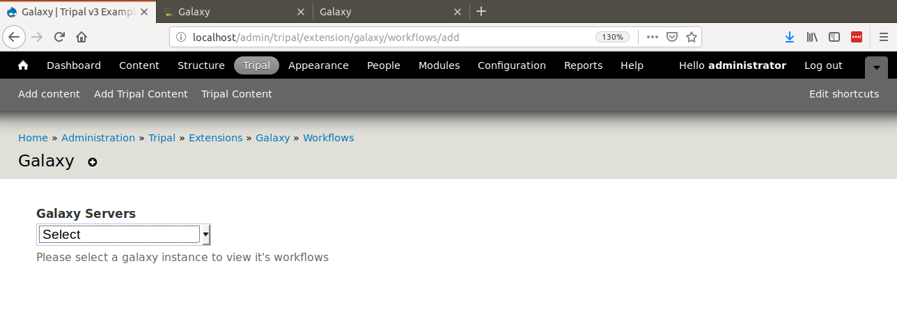
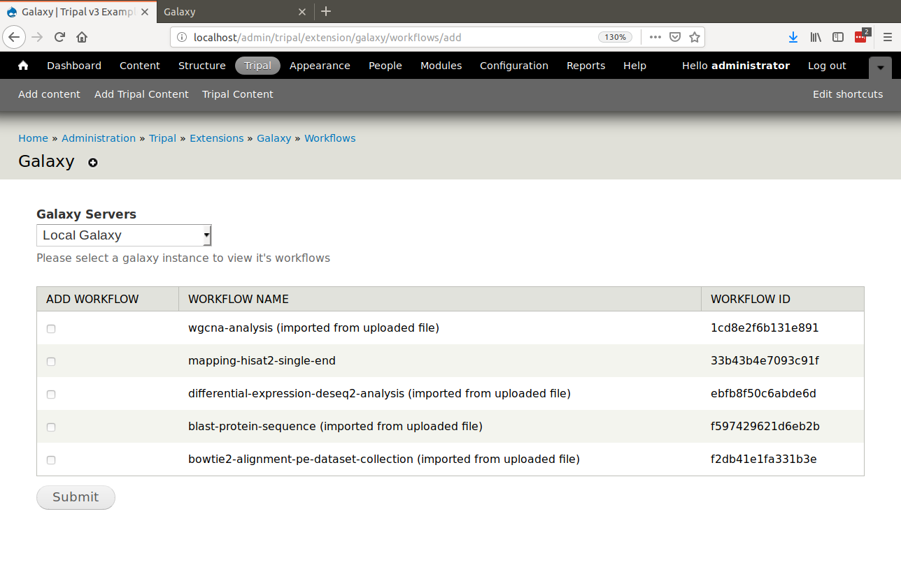
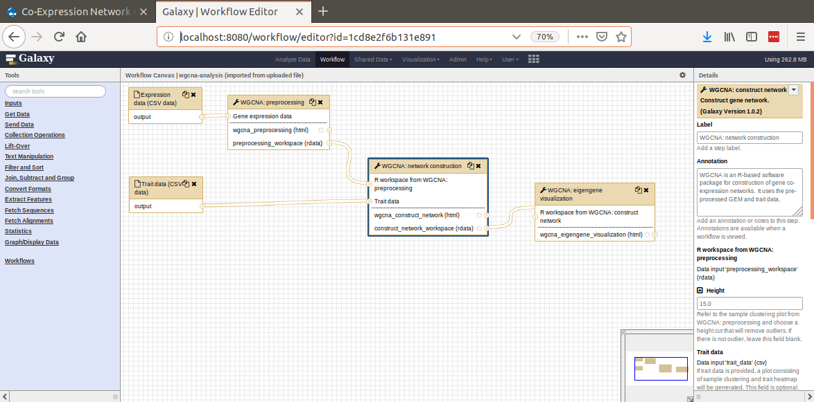
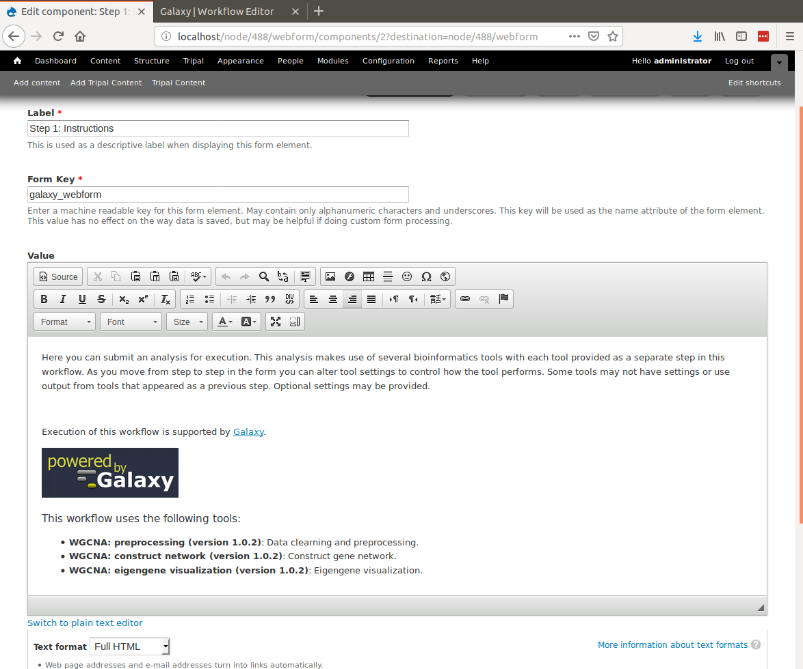

Adding a New Workflow
=====================
Now that Tripal is aware of a Remote Galaxy server we can integrate workflows with the site.  To do this, navigate to the Tripal Galaxy administration page at **Administration > Tripal > Extensions > Galaxy** and click the **Workflows** tab.  

.. image:: ./workflows.1.png

Currently, there are no workflows available. A workflow can be added by clicking the **Add workflows** link.  A page appears with a single select box containing a list of Galaxy servers that Tripal knows about.

Select a Galaxy server and a list of workflows appears. In the previous :doc:`./remote_servers` section we added the UseGalaxy public server.  However, for the remainder of this tutorial we will use a local Galaxy server which has several pre-installed workflows from the `Staton Lab Galaxy Workflows library <https://github.com/statonlab/galaxy-workflows>`_.

Here we can select any number of workflows to enable on our Tripal site by checking the select box to the left of each workflow and clicking the **Submit** button.  The Tripal Galaxy module will connect to the remote Galaxy server, retrieve information about the workflow and automatically create a web form for users to submit.  For this example we will enable the workflow named ``wgcna-analysis (imported from uploaded file)`` which performs gene co-expression network (GCN) construction.

.. image:: ./workflows.4.png

Below is an image of the WGCNA workflow on the Galaxy server:

After the workflow has been added to Tripal a message is provided indicating that we may want to adjust the title, instructions and other information about the workflow.  We may want to do this to help improve the user experience for a user who wants to run a workflow and needs details or instructions specific to your site.  To do this, click the link to the workflow in the **Workflow Name** column.  The following page appears:

.. image:: ./workflows.5.png

Tripal Galaxy will provide a set of default introductory instructions which are shown on the page.  The title of the workflow is also not very user friendly. We can first change the title by clicking on the **Edit** tab.  Here you can change the title to something such as "Co-Expression Network Construction (WGCNA)"

.. image:: ./workflows.6.png

Click the **Save** button.

Next, to update the instructions, click the **Webform** tab.  Here you will see a list of every field in every step of the workflow.

.. image:: ./workflows.7.png

.. warning::

  Be cautious editing any of the fields on the **Webform** tab as they are needed for the workflow.  It is safe to edit any field of type **Markup** or, to change the **Label** and **Description**.  Do not change the **Form Key** or any other default values.  
  
To change the instructions, click the **Edit** link for the column with the **Label** `Step : Instructions` of type **Markup** (the field on the second row).  The following page appears:

.. note::

  If the **value** field on the form shows pure HTML you may want to install a WYSIWYG editor such as ``ckeditor`` using a command such as:
  
 .. code::
 
  drush pm-enable ckeditor

  
Edit the instructions to your liking and click the **Save component** button at the bottom of the page.  Click the **View** tab to see how things have changed:

.. image:: ./workflows.9.png

You can now browse through the workflow, to ensure that the end-user experience matches your expectations.  Click the **Next Page** button to see the next step in the workflow.  

.. image:: ./workflows.9.png

If you see a description or help text that does not meet your liking you may change it by clicking the **Webform** tab, finding the correct component and editing appropriately.  Remember to only change labels, descriptions and help text. Do not change the form keys or default values or conditionals.

Once you have completed any edits to the workflow you can make it available for end-users by adding the URL for the workflow to your sites Menu as needed. Notice in the previous screenshot that our workflow can be found on our site at the relative URL ``node/488``.  Navigate to the **Administer > Structure > Menus** and add the workflow to the most appropriate menu for your site. 

.. note::
 
  We do not show here how to create menus as that is covered by the Tripal v3 User's Guide and Tripal documentation.
