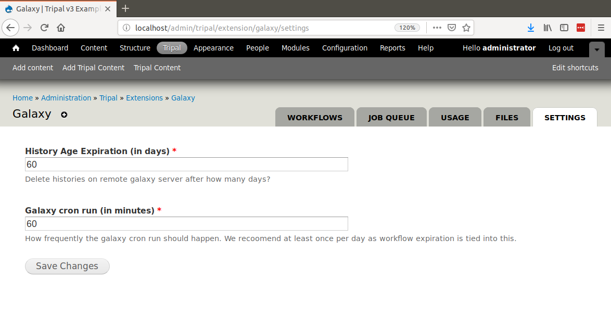

Additional Settings
===================
There are a few additional settings you may want to adjust to fine tune integration with Galaxy.  You can adjust settings by navigating to the **Administer > Tripal > Extensions > Galaxy** page and click the **Settings** tab.  Here you will find two settings. One for altering the expiration date for histories on remote Galaxy servers and one for adjusting how often the the Tripal Galaxy module should run the cron. 

The first setting ensures that results submitted by users do not pile up and use up your file storage quota on the remote Galaxy server.  The second settings adjust how often the Tripal Galaxy cron job runs.  When the cron runs the following actions occur:

1. **Server Status Checks**: All Galaxy servers registered with Tripal are checked to see if they are available. If not then workflows are automatically marked as disabled preventing further submissions. If workflows are disabled, a message is added to the Drupal dashboard.
2. **History Cleanup**: All histories on the remote Galaxy servers that are older than the number of days specified by the **History Age Experiation** value are deleted.
