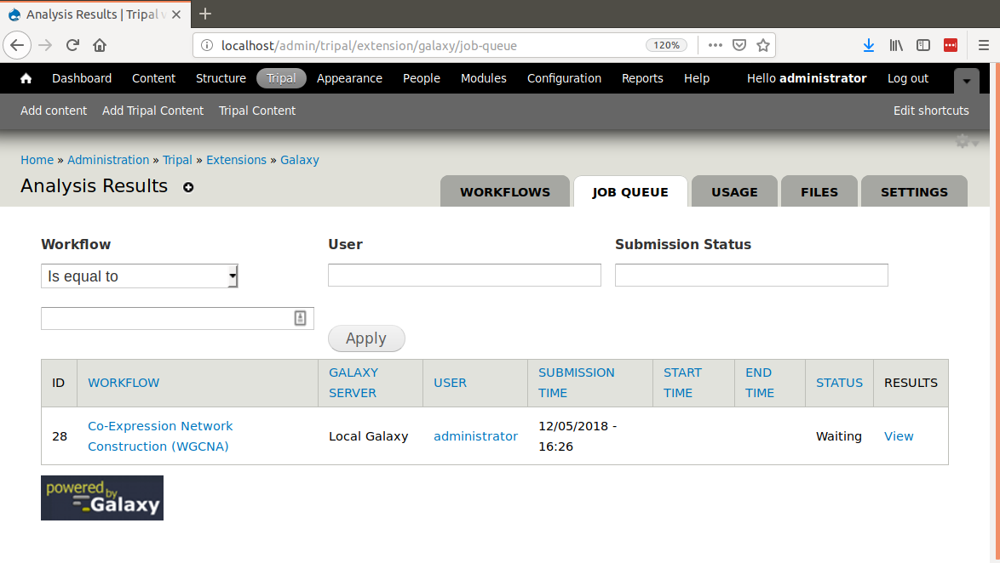
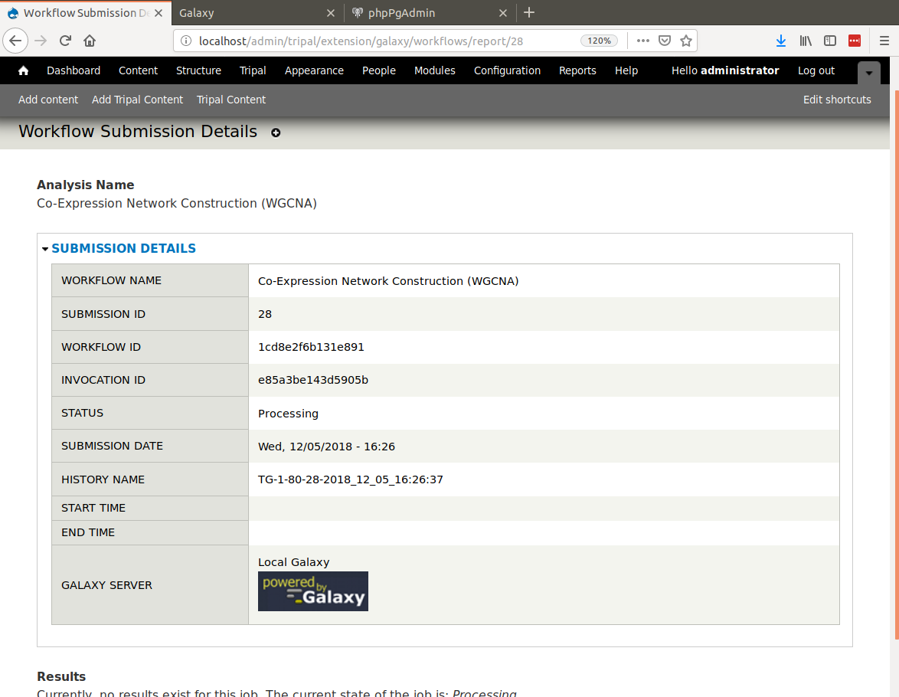
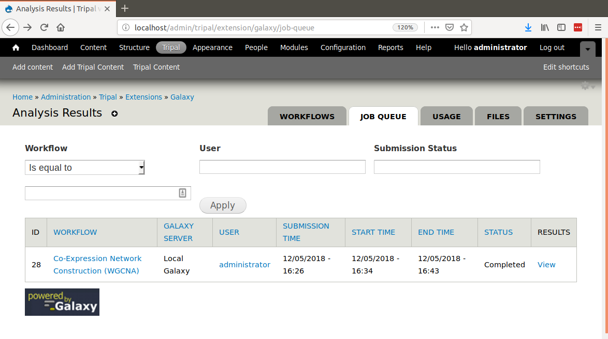

Monitoring Usage
================
Once workflows are made available to end-users you will want to monitor usage. There are two tools to assist with this.  Navigate to the Tripal Galaxy administration pages at **Administer > Tripal > Extensions > Galaxy**.  You will two tabs named **Job Queue** and **Usage**

The Job Queue
~~~~~~~~~~~~~
The job queue is a tool that lists all of the currently active jobs.  It provides details about who submitted the job, the job state, submission, start and end time.  

The example above shows the first submission of a Galaxy workflow on our example site. Currently the workflow has a stutus of 'Waiting'.  The job will stay in the waiting state until the Tripal Job launcher invokes the job.  If you have not setup Tripal for automated job submission, please review the `instructions in the Tripal v3 User's Guide <https://tripal.readthedocs.io/en/latest/user_guide/install_tripal/automating_job_execution.html>`_.

When a job is invoked by the Tripal Job launcher, the following occurs:
1. A history is created uniquely for this workflow submission on the remote Galaxy site.  The Tripal Galaxy module ensures that each workflow submission executes in a unique history.
2. All files needed for the workflow are uploaded to the remote site into the newly created history.
3. Any data collections (groups of files such as paired-data) are organized in the history on the Galaxy server.
4. The workflow is invoked and beings executing on the Galaxy server once resources are available.
5. An email is sent to the end-user indicating that the job has been submitted.

If you were to visit the Galaxy server you should be able to find the history for the submitted workflow and see that the job is running. 

.. image:: usage.2.png

To do this, you need to know the history name.  You can find the history ID for this submission by clicking on the **View Results** link in the job queue. The resulting page will indicate that no results are availalbe for non completed jobs, but if you open the **Submission Details** field set you can find the history name in the table.

As the workflow proceeds the status in the job queue is updated until finally the workflow completes:

Usage Stats
~~~~~~~~~~~
The Tripal Galaxy Module also provides some simple bar charts indicating the top workflows submitted and users of workflows.  To retrieve these reports navigate to **Administer > Tripal > Extensions > Galaxy** and click the **Usage** tab.  

The following is an example results for a new site that has had just a few workflows executed by the administrator user (most likely just for testing).

.. image:: usage.5.png
