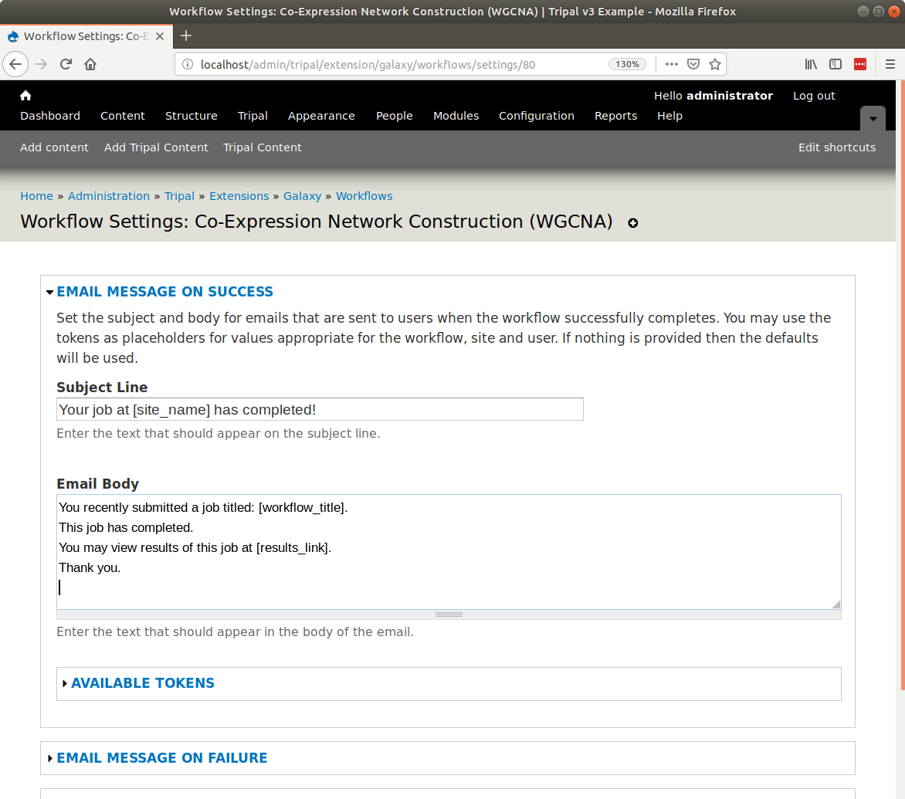
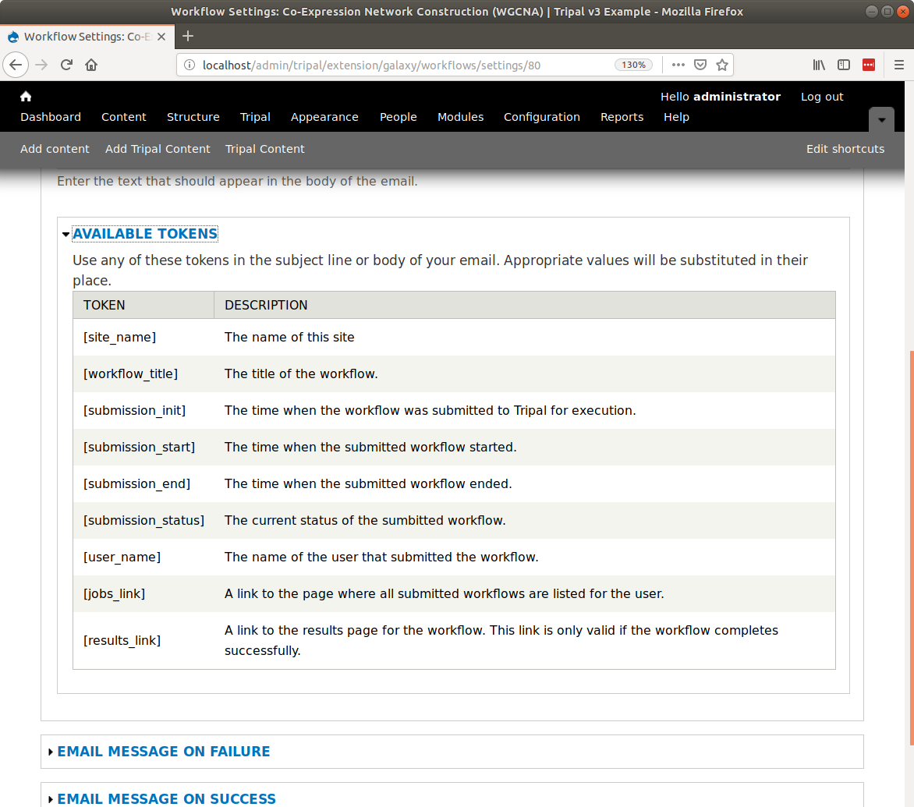

Workflow Settings
=================
Regardless if you add workflows using option #1 or #2 there are a few settings you can set to customize the way users interact with workflows.  On the workflow administration page at ``Administer > Tripal > Extension > Galaxy > Workflows`` you will see a ``Settings`` link for each workflow.

.. image:: workflow_settings.1.png

Clicking the ``Settings`` link beside a workflow will take you to the Settings page for that workflow. 

Customizing Emails
------------------
Currently the setting page allows you to customize the email text that is sent to end-users when the workflow is invoked and also when it either fails or succeeds.

You can change the text of the subject line and the body of the email by altering the text in the fields.  Additionally, you can use tokens as placeholders for text that you want included in the messages.  You can find a list of available tokens by opening the ``Available Tokens`` fieldset. If you do not want a workflow to send email you can disable the email by clicking the checkbox whose title begins: ``do not send email``.

For example, if you want to include the submission time of the workflow in the body of the email that gets sent when the workflow is invoked, you should add the token ``[submission_init]``.  When the email is sent this token will be replaced with the submission time.  Be sure to click the ``Submit`` button after making any changes.
